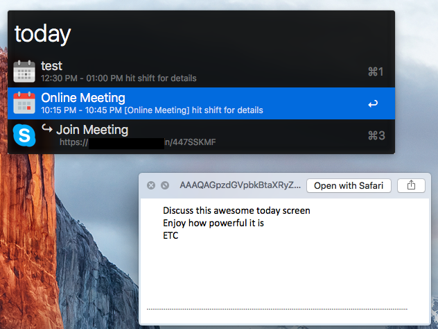

#Today Workflow


Use **today** to open the workflow and **tc** to open the config menu


This workflow will query an EWS (Exchange Web Service) and pull down a list of Today's meetings.

If you are using Skype/Lync and you set the correct regex it will also parse out the Meeting URL

You can click **shift** on an entry to load a **QuickLook** preview of the item.



# Usage

Available Commands:

* **Today** (shows the today list)
* **Tomorrow** (shows list for tomorrow)
* **tc** (loads configuration)

# Configuration

You can see configuration items with the **tc** command and make changes

##**Username** and **Password**

The workflow will extract these entries out of the OSX keychain from the keychain entry for `outlook.office365.com`

If for some reason you do not have this value you will get an error message like:


```bash
security add-generic-password -a USER@DOMAIN -s exchange.password.org -w PASSWORD
```

## Exchange Server

This workflow uses a version of PyExchange modified to use **Basic Authorization** instead of **NTLM** to connect to the exchange server.  According to Microsoft NTLM is only available for internal exchange servers - so its possible this workflow will only work with cloud hosted servers.  

The default server is `https://outlook.office365.com/EWS/Exchange.asmx`.  This _is_ a configurable option, however, I do not have any different exchange servers to test against so please let me know if it actually works


## Regex

If you are using Skype or Lync and embed an online meeting you have can use a regular expression to parse this text out.  Ideally this should work with other meeting types, however, again I do not have access to other options to try.


  For example if your online meeting URL is `http://meet.alfred.com/alfred/332344` you could use a regex of

```perl
(https:\/\/meet.alfred.com[^"]*)
```

Type **tc** to open the configuration menu, select the Regex Option

And enter your regex


#Feedback & Help

Please open an issue on `Github` and/or post on [alfred forum link](http://www.alfredforum.com/topic/9223-today-menu-for-microsoft-exchange-servers/)

